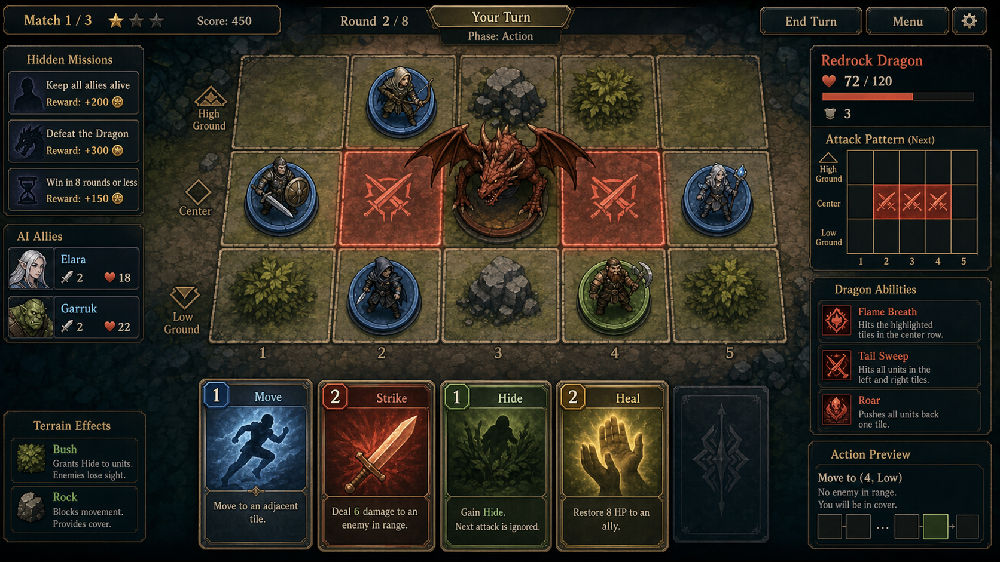

# DragonTactics — Game Design Document



- 문서 유형: 게임 기획서 (GDD)
- 문서 버전: 2.0
- 프로젝트 버전: **1.0.1** (근거: `package.json` `"version": "1.0.1"`, 코드 직접 확인)
- 작성/갱신일: 2026-09-11 (KST)
- git 참조: branch `main`, HEAD `0303c72e024b3dfc3ab416eebf724658a9a21e71` (`.git/refs/heads/main` 직접 열람, 이번 세션은 셸 실행 권한이 없어 `git log`/`git status`는 실행하지 못함)
- 근거 등급 표기: **[코드검증]** 이번 세션에 소스 파일을 직접 Read해서 확인한 사실 / **[문서인용]** `docs/DragonTactics_기획서.md` 등 기존 문서의 서술을 그대로 인용(코드로 재검증하지 않음) / **[제안]** 이번 문서에서 새로 제시하는 기획 가설 / **미검증(코드에서 확인 안 됨)** 근거를 찾지 못해 추측하지 않고 명시적으로 비워둔 항목

> 참고: 이전 버전 GDD(문서 버전 1.0)는 `docs/` 하위 문서 본문을 열람하지 않은 채 파일명만으로 작성되어 프로젝트 버전을 0.4.0으로 오기재하고 있었다. 이번 개정은 `docs/DragonTactics_기획서.md`, `js/*.js`, `tests/*.test.js`를 모두 직접 열람해 재작성한 것이다. 기존 GDD.md 및 `docs/DragonTactics_기획서.md`에는 리비전 색상 마크업(`<span style="color:...">`)이 없어 보존할 색상 구간이 없었다. `gameplay_preview` 관련 상대 경로 링크도 기존 GDD.md 본문에 없어 보존 대상이 없다(해당 링크는 `docs/image-resources.md`에서만 참조됨).

---

## 1. 기획 품질 6요소

1. **목표(Goal)** — [문서인용/제안] 짧은 세션(10~20분)에서 "드래곤의 다음 공격을 미리 보고, 카드 1장으로 피해를 줄이거나 보상을 챙긴다"는 예측 기반 전술 판단을 명확하게 체감시킨다. (근거: `docs/DragonTactics_기획서.md` §2 문제 정의, §6 Preview/Last Result 패널)
2. **핵심 재미(Core Fun)** — [코드검증] 드래곤 카드가 `revealed` 배열로 사전 공개되고(`js/state.js`, `js/engine.js:refillRevealed`), `getDragonActivationPreview()`(`js/dragon.js`)가 예상 피해를 미리 계산해 보여준 뒤, `executeDragonTurn()`이 실제 결과를 `lastActivationSummary`(forecastDamage/damageDelta 포함)로 되돌려준다. 즉 "예측 → 대응 카드 선택 → 실제 결과 대조"가 코드로 구현된 핵심 재미 루프다.
3. **대상 사용자(Target User)** — [문서인용] Into the Breach류 격자 전술을 좋아하는 PC 인디 전략 플레이어, 퇴근 후 10~20분 집중 플레이층(`docs/DragonTactics_기획서.md` §1, §3). [문서인용] `docs/persona_playtest_feedback.md`의 페르소나(이승빈/37세 상당, "위험을 계산하고 결과를 미리 보고 싶어하는" 전술 플레이어)와 일치.
4. **차별점(Differentiation)** — [코드검증] 드래곤이 보드 칸을 점유하지 않는 "off-grid" 보스(`js/state.js` 주석: "Dragon does NOT occupy any board cell"), 공격은 행/열/코너/전체 패턴으로만 전개(`js/dragon.js: affectedCells`). 아군 AI가 반자동으로 움직이며(`js/ally-ai.js`) 플레이어는 자신의 카드 선택에 집중한다.
5. **성공지표(Success Metric)** — 미검증(코드에서 확인 안 됨): 실제 리텐션/재도전율 등 라이브 KPI 계측 로직은 코드에서 발견하지 못함. [문서인용] `docs/DragonTactics_기획서.md`는 정성적 검증(테스트 통과 수, 포터블 빌드 생존 시간)만 기록하고 있으며 정량 KPI 계측 파이프라인은 문서에도 없음.
6. **리스크(Risk)** — [코드검증] 미션 정의 헤더 주석과 실제 배열 길이가 불일치(§5 참조, 예: 주석 "Common (7)"이지만 실제 8개). 콘텐츠 밸런싱 문서 자동 동기화 부재로 향후 수치 드리프트 위험. [문서인용] `docs/DragonTactics_기획서.md` §12에 남은 리스크로 "Steam 앱 ID 480(임시)", "SVG/코드 자산의 PNG 아틀라스 교체 진행 중" 등이 명시됨. [코드검증] `js/main.js: showMatchResult`는 `<h2 class="mr-title">매치 ${matchIndex + 1}/3 종료</h2>`와 `matchIndex < 2 ? '다음 매치' : '최종 결과'` 분기를 고정값 3(과 2)으로 하드코딩하고 있는데, 실제로는 `showDragonVote()`에서 드래곤 처치 목표(`targetDragonKills`)를 1~5 중 선택할 수 있다(`js/main.js` `data-kills="1".."5"`, `js/state.js: createInitialState`의 `Math.max(1, Math.min(5, ...))` 클램프). 3이 아닌 목표를 선택하면 결과 화면 문구/버튼 분기가 실제 진행 상황과 어긋나는 구현 불일치가 코드로 확인된다.

---

## Core Loop (핵심 루프)

핵심 루프는 6장 "재미 체인(Fun Chain)"에 코드 근거와 함께 이미 정리되어 있다: **드래곤 카드 공개(revealed) → 프리뷰 패널의 예상 피해 계산(getDragonActivationPreview) → 플레이어 대응 카드 선택(executePlayerAction) → 아군 AI 자동 행동(decideAllyAction) → 드래곤 턴 자동 해결(executeDragonTurn, damageDelta 기록) → 미션/보물/페이즈 반영 후 다시 드래곤 카드 공개로 순환**. 각 단계의 코드 근거는 6장을 참조.

## 2. 디자인 필러 (Design Pillars)

- **필러 1 — 완전 공개 정보(Full Information) 전술**: [코드검증] 드래곤 카드는 `phase` 개수만큼 `revealed` 배열에 미리 노출되고(`executeDragonTurn`의 `actions = phase (+storm이면 +1)`), `resolveRandomizedReveal()`이 주사위형 열/행 카드도 공개 시점에 즉시 확정한다. 정보를 숨기지 않고, 그 정보를 활용한 판단력을 시험한다.
- **필러 2 — 위치 = 자원**: [코드검증] 드래곤 공격 대상 판정(`js/dragon.js: applyPatternCard`)과 공격 가능 여부(`js/engine.js: canAttackDragonFrom`, `ATTACK_ROW = 0`)가 모두 3×5 보드 위 좌표에 의존한다. 이동 카드 1장의 선택이 방어/공격 기회를 동시에 결정한다.
- **필러 3 — 반자동 파티 운영**: [코드검증] 플레이어 1명 + AI 아군(`js/ally-ai.js: decideAllyAction`)이 함께 싸우며, 종족(Human/Elf/Dwarf/Orc)마다 다른 우선순위 로직(생존→오크 배신 확률 30%→드래곤 처치→협력 치유→패 관리)을 가진다.
- **필러 4 — 예측과 결과의 대조 학습**: [코드검증] `dragon.lastActivationSummary.damageDelta`(예측치 대비 실제 피해 차이)가 상태에 저장되어 다음 판단의 학습 자료가 된다. `js/tutorial-scenarios.js`의 3개 시나리오(조기/지연/기회상실)가 이 필러를 튜토리얼로 구체화한다.

---

## 3. 컴포넌트 표 (역할 / 선택 / 입력→판단→피드백 / 상태)

| 컴포넌트 | 역할 | 선택(플레이어가 고르는 것) | 입력 → 판단 → 피드백 | 상태(코드 근거) |
|---|---|---|---|---|
| 드래곤 카드 프리뷰 패널 | 다음 드래곤 턴의 예상 피해를 시각화 | 대응 카드(이동/방어/공격 등) 1장 선택 | 카드 목록 공개(`revealed`) → `getDragonActivationPreview()`가 대상자·예상피해·Shield/Hide 시뮬레이션 계산 → 프리뷰 패널에 대상/피해량 표시 | [코드검증] `js/dragon.js: getDragonActivationPreview` |
| 손패(Hand) | 이동/공격/방어/치유/정찰/도발/보물 카드 보유 | 카드 1장 사용 또는 `drawTwo`/`discardAndRedraw`/`discardAndSwapMissions` 액션 | 카드 클릭 → `executePlayerAction()`이 카드 타입별 함수로 분기 → `lastActionEvent`로 애니메이션/로그 피드백 | [코드검증] `js/engine.js: executePlayerAction` |
| 3×5 보드 | 아군 위치, 드래곤 공격 판정 지형 | 이동 목적지, 공격 대상, 보물 카드의 대상 칸 | 좌표 클릭/선택 → 직교 이동·사거리·공격존(행 0) 검증 → 보드 갱신 + 로그 | [코드검증] `js/engine.js: applyMoveCard`, `canAttackDragonFrom` |
| 드래곤 패널(Last Result) | 드래곤 턴 실행 후 실제 결과 표시 | (플레이어 입력 없음, 결과 확인만) | 드래곤 카드 자동 해결 → `buildDragonActivationSummary()`가 예측 대비 실제 피해/탈락 계산 → Last Result 패널 표시 | [코드검증] `js/engine.js: buildDragonActivationSummary`, `executeDragonTurn` |
| 미션 패널 | 공통/종족 필수·선택 미션 진행률 표시 | 손패 4장 소모로 미션 교체(`discardAndSwapMissions`) | 매치 시작 시 `assignMissions()`로 배정 → 액션마다 `missionProgress` 갱신 → `evaluateMission()`으로 달성 판정 | [코드검증] `js/missions.js`, `js/engine.js: MISSION_SWAP_COST = 4` |
| 아군 AI 유닛 | 플레이어 대신 자동으로 행동하는 동료 3명(4인 기준) | (플레이어 선택 없음, 종족별 로직이 자동 결정) | 매 턴 `decideAllyAction()` 호출 → 생존/배신/처치/협력/패관리 우선순위 트리 판단 → 카드 사용 또는 이동 실행 | [코드검증] `js/ally-ai.js` |
| 사운드 레이어 | 행동/드래곤 공격/승패에 대한 청각 피드백 | (없음, 자동 재생) | 액션 이벤트 발생 → `sfxAttack/sfxHeal/sfxDragonAttack/sfxPhaseTransition` 등 호출 → `GameAudioLayer.play(cue)`로 OGG 재생 | [코드검증] `js/sound.js`, `assets/audio/game-audio-layer.js` |

---

## 4. 콘텐츠 수량 / 유닛 / 해금 조건 / 공급 / 보상 / 변주 요소 (코드 검증)

### 4.1 종족(4종) — [코드검증] `js/races.js`

| 종족 | 최대 HP | 추가 드로우 확률 | 공격 피해 보너스 | 공격 사거리 보너스 |
|---|---:|---:|---:|---:|
| 인간(human) | 5 | 5% | 0 | 0 |
| 엘프(elf) | 5 | 0% | 0 | +1 |
| 드워프(dwarf) | 6 | 0% | 0 | 0 |
| 오크(orc) | 5 | 0% | +1 | 0 |

- 종족 배정: [코드검증] `js/state.js: startMatch` — `races[idx % races.length]`로 결정론적 라운드로빈 배정(고정, 무작위 아님).
- 해금 조건: 미검증(코드에서 확인 안 됨) — 종족은 매치 시작 시 자동 배정되며, 코드 내에서 "해금"을 통해 신규 종족을 얻는 로직은 발견하지 못함(전 종족이 처음부터 사용 가능한 구조로 보임).

### 4.2 드래곤 타입(5종) — [코드검증] `js/dragons.js`

| ID | 이름 | 최대 HP | 속성 | 기믹 |
|---|---|---:|---|---|
| fire | Fire Dragon | 12 | Flame | 패턴 공격 +1 피해 |
| ice | Ice Dragon | 12 | Frost | 피격 시 카드 1장 버림 |
| venom | Venom Dragon | 12 | Poison | 피격 시 1라운드 중독 |
| storm | Storm Dragon | 12 | Lightning | 드래곤 턴마다 카드 1장 추가 해결 |
| gold | Gold Dragon | 12 | Radiance | 2피해 실드로 시작 |

- 선택 방식: [코드검증] `pickDragonType(seed, matchIndex)`가 `createRng(seed + matchIndex*4099 + 97)`로 시드 기반 결정론적 선택(완전 무작위 아님, 시드 고정 시 재현 가능).

### 4.3 카드(플레이어 덱, `js/cards.js: buildPlayerDeck`) — [코드검증]

| 카드 타입 | 세부 | 매수 |
|---|---|---:|
| 이동(move) | range 2 | 8 |
| 이동(move) | range 3 | 7 |
| 이동(move) | range 4 | 5 |
| 공격(attack) | range 1 | 8 |
| 공격(attack) | range 2 | 5 |
| 공격(attack) | range 3 | 2 |
| 은신(hide) | — | 4 |
| 치유(heal) | — | 3 |
| 정찰(scout) | — | 2 |
| 도발(taunt) | — | 2 |
| 보물(treasure) | sword/potion/cloak/shield/rune/tome 각 1 | 6 |
| **합계** | | **52장** |

- 보물 6종 효과: [코드검증] `js/engine.js` — sword(드래곤 3피해+처치 미션 갱신), potion(HP 전체 회복), cloak(사거리 1~2 순간이동), shield(다음 피해 1회 무효), rune(다음 카드 보너스 2, `runeBonusNext` 상태만 세팅되고 실제 소비 로직은 이번 세션에서 추가로 확인하지 못함 — 미검증), tome(손패 4장 이하일 때 카드 2장 드로우).
- 영웅의 검(sword) 특수 규칙: [코드검증] `pullSwordIfEligible()` — 드래곤에 가장 가까운(행 번호가 가장 낮은) 생존 플레이어가 드로우/재드로우 시 discard에 있는 sword를 확정 획득.

### 4.4 드래곤 카드(공격 패턴 덱, `js/dragon.js: DRAGON_CARD_DEFS`) — [코드검증]

| 타입 | 매수 | 페이즈 게이트 | 피해(기본, fire면 +1) |
|---|---:|---:|---:|
| rest(휴식) | 3 | 1 | 0 |
| row-attack(행 공격, 주사위) | 5 | 1 | 2 |
| col-attack(열 공격, 주사위) | 4 | 1 | 2 |
| roar(포효, 다음 라운드 플레이어 주사위 -1) | 2 | 1 | 0 |
| corners(코너 4칸) | 1 | 1 | 2 |
| row-odd(테두리 행 0·2) | 2 | 2 | 1 |
| all(전체 공격) | 1 | 2 | 1 |
| row-even(중앙 행 1) | 1 | 3 | 2 |
| frenzy(광란, 전체 공격) | 1 | 3 | 1 |

- 매치 시작 시 실제 사용 덱: [코드검증] `buildDragonCards(1)` 호출 — 페이즈 1 조건만 포함해 **15장**(rest3+row-attack5+col-attack4+roar2+corners1)으로 시작. 페이즈 상승 후 2/3단계 카드가 어떻게 덱에 합류하는지는 `refillRevealed()`가 `state.dragon.deck`/`discard`만 셔플·보충하는 구조이며, phase 2·3 카드가 초기 덱에 아예 포함되지 않는 것으로 보여 **미검증(코드에서 명확한 phase 카드 합류 시점을 확인하지 못함)**.
- 페이즈 전환: [코드검증] `maybeTransitionPhase` — HP≤8이면 phase 2, HP≤4이면 phase 3 (최대 HP 12 기준).
- 드래곤 턴당 해결 카드 수: [코드검증] `phase + (type === 'storm' ? 1 : 0)`장.

### 4.5 미션(총 31개, 공통 8 + 인간 4 + 엘프 5 + 드워프 5 + 오크 9) — [코드검증] `js/missions.js`

- 실제 배열 길이를 직접 세어 확인: 공통 8개(`common-attack-5` ~ `common-pickup-drop-1`), 인간 4개, 엘프 5개, 드워프 5개, 오크 9개.
- **주의**: 소스 코드 주석은 "Common (7)", "Elf (4)"로 적혀 있으나 실제 배열 길이는 각각 8개, 5개로 주석과 실제 데이터가 불일치한다(코드 검증 결과 기준 이 문서는 실제 배열 길이를 채택).
- 배정 방식: [코드검증] `assignMissions()` — 종족별 자격 미션 중 셔플 후 첫 번째를 필수, 그 다음 `requiredOnly`가 아닌 것 중 하나를 선택으로 배정.
- 점수/보상: [코드검증] `scoreMatch()` — 필수 미션 성공 시 해당 포인트, 선택 미션 성공 시 해당 포인트, 드래곤 최종 타격자(finisher) +3, 생존자 +1. 실제 게임 내 재화(골드/젬 등) 교환 로직은 미검증(코드에서 확인 안 됨) — 미션 점수가 화면 밖 메타 재화로 전환되는 로직은 발견하지 못함.

### 4.6 보물 드롭(공급) — [코드검증] `js/engine.js`

- 드래곤 HP가 10/8/6/4/2 임계값을 하향 돌파할 때마다 시드 기반 RNG로 보드 임의 칸에 보물 1개 드롭(`DROP_THRESHOLDS`, `DROP_TREASURES` 6종).
- 드롭은 해당 칸을 드래곤이 다시 공격하면 소각(`burnDropsInCells`)되므로 즉시 회수가 유리하도록 설계됨.
- 매치 진행: [코드검증] `state.js: createInitialState` — `targetDragonKills`는 1~5 사이로 클램프(기본값 3). [문서인용] `docs/DragonTactics_기획서.md`는 "3매치 토너먼트"로 서술.
- 라운드 상한: [코드검증] `checkMatchEnd` — `state.round > 30`이면 `'timeout'`으로 매치 강제 종료.

---

## 5. 플레이 세션 길이별 설명

- **30초**: [코드검증 기반 제안] 드래곤 카드 공개(`revealed`) 확인 → 프리뷰 패널에서 예상 피해자/피해량 확인 → 손패 1장을 골라 이동 또는 방어 카드를 사용하는 한 번의 판단 사이클. `js/tutorial-scenarios.js`의 "조기 활성화" 시나리오가 이 30초 단위 학습을 그대로 담고 있다.
- **5분**: [제안] 한 라운드 내 전원의 턴 진행(`rollTurnOrder` → 각 플레이어/아군 행동 → `executeDragonTurn`) + 페이즈 전환 관찰 1~2회. 보물 드롭 1개 정도를 회수하는 정도의 진행.
- **30분**: [문서인용/제안] `docs/DragonTactics_기획서.md`가 명시한 "타깃 세션 10~20분"에 근접한 길이로, 드래곤 1마리를 처치(`dragon-dead`)하거나 파티가 전멸(`party-wipe`)하는 한 매치 전체를 완주하는 분량.
- **장기 세션**: [코드검증 기반 제안] `targetDragonKills`(최대 5)만큼 여러 매치를 이어서 진행하는 토너먼트 모드. `matchScores` 배열이 매치별 점수를 누적하므로, 여러 판의 미션 성과를 비교하며 플레이하는 장기 루프가 가능하다.

---

## 6. 재미 체인 (Fun Chain)

[코드검증 기반 서술]

```
드래곤 카드 공개(revealed)
  → 프리뷰 패널이 예상 피해자·피해량 계산 (getDragonActivationPreview)
    → 플레이어가 손패에서 대응 카드 1장 선택 (이동/방어/공격/보물 등)
      → executePlayerAction()이 카드 효과를 즉시 반영 (보드/HP/미션 진행)
        → 아군 AI가 자신의 우선순위 트리로 자동 행동 (decideAllyAction)
          → 드래곤 턴 자동 해결 (executeDragonTurn), lastActivationSummary에
            forecastDamage 대비 damageDelta 기록
              → Last Result 패널에서 "예측이 맞았는가"를 확인
                → 미션 진행률·보물 드롭·페이즈 전환을 반영해 다음 판단으로 순환
```

이 체인의 동력은 "정보를 이미 다 봤는데도 내 선택이 최선이었는가"를 매 라운드 확인시키는 데 있다 — 이는 §2 필러 4와 직결된다.

---

## 7. 실제 플레이 예시 2개 (코드/데이터 기반)

### 예시 1 — 조기 대응으로 피해를 절반으로 줄이기 (`js/tutorial-scenarios.js: dragon-timing-early`)

- 시드 4101, 초기 드래곤 카드 `row-attack`(rowIndex 0, 행 0 전체 공격).
- 플레이어 위치 `{r:0, c:1}` — 정확히 위협 행 위에 서 있음.
- 프리뷰: `expectedPreview.totalExpectedDamage = 1`, 대상 `P0`에게 1피해 예상하되 `mitigation: 'hide'` — 즉 은신(hide) 카드를 미리 쓰면 `estimateDamageForPlayer()` 로직상 1피해를 0으로 만들 수 있음이 프리뷰에 이미 반영됨.
- 결과(`expectedSummary`): 실제로도 P0가 1피해를 받는 것으로 기록(시나리오상 대응하지 않았을 때의 기준값). 교훈(코드 원문): "Use the visible dragon card before activation to spend hide or move early, reducing a row hit before damage lands."

### 예시 2 — 영웅의 검으로 최종 타격 미션 달성 (`js/engine.js: applyTreasureSword` + `js/missions.js: human-kill-dragon`)

- 인간 종족 플레이어가 드래곤에 가장 가까운(행 번호 최소) 위치에서 재드로우(`applyDiscardAndRedraw`)를 실행하면, `pullSwordIfEligible()`이 discard 더미에 있던 `sword` 보물을 확정으로 손패에 지급한다.
- 드래곤 HP가 3 이하일 때 `sword`를 사용(`applyTreasureSword`)하면 3피해를 입혀 `dragon.hp`를 0으로 만들고, `attacker.missionProgress.killedDragon = true`가 설정된다.
- 이 시점에 인간 종족 필수/선택 미션 중 `human-kill-dragon`(5점)이 `evaluateMission()`에서 `mp.killedDragon === true`로 충족되며, 매치 종료 시 `scoreMatch()`가 5점 + finisher 보너스 3점 + 생존 보너스 1점(생존 시)을 합산한다.

---

## 8. 피로도 / 실패 완화 장치

- [코드검증] **Shield(방패 실드)**: `damagePlayer()`에서 `statusEffects.shieldActive`가 있으면 피해를 0으로 만들고 1회 소모.
- [코드검증] **Hide(은신)**: `hiddenThisRound` 상태로 이번 라운드 피해 1을 경감(완전 무효화 아님, `Math.max(0, dmg - 1)`).
- [코드검증] **Potion(물약)**: 즉시 최대 HP까지 전체 회복.
- [코드검증] **Heal(치유) 카드**: 인접 아군 또는 자신 HP 1 회복, 아군 AI도 인접 부상자를 우선 치유(`decideAllyAction` priority 5).
- [코드검증] **아군 AI 생존 우선순위**: HP≤1이면 치유/물약/은신을 최우선 시도(`decideAllyAction` priority 1) — 플레이어가 아군을 세세히 관리하지 않아도 즉사 위험을 어느 정도 자동 완화.
- [코드검증] **라운드 종료 시 임시 상태 초기화**: `clearRoundStatus()`가 `hiddenThisRound`, `tauntThisRound`, `poisoned`를 매 라운드 리셋 — 상태이상이 무한 누적되지 않음.
- [코드검증] **미션 교체(구제 장치)**: 손패 4장을 소모해 언제든 미션을 재배정(`discardAndSwapMissions`) — 불리한 미션 조합을 받았을 때 탈출구.
- 미검증(코드에서 확인 안 됨): 매치 패배(파티 전멸) 이후 별도의 "패배 완화 보상"(예: 부분 재화 지급) 로직은 발견하지 못함 — `scoreMatch()`는 생존 여부와 무관하게 미션/finisher 조건만 채점.

---

## 9. 경제 / 성장 / 밸런스 레버

- [코드검증] **덱 크기와 카드 비율**: 이동 20장 / 공격 15장 / 은신 4장 / 치유 3장 / 정찰 2장 / 도발 2장 / 보물 6장(총 52장) — 이동·공격 비중이 압도적으로 높아 "이동해서 공격존(행 0) 도달"이 기본 전략축.
- [코드검증] **레이스 보너스**: 오크(+공격피해), 엘프(+사거리), 드워프(+최대HP), 인간(+5% 추가 드로우) — 4종족이 서로 다른 축(딜/사거리/생존력/자원)으로 밸런싱됨.
- [코드검증] **드래곤 HP 12 고정 + 페이즈 임계값(8/4)**: 모든 드래곤 타입이 동일한 HP·페이즈 구조를 공유하고, 타입별 기믹(피해+1, 카드버림, 중독, 추가행동, 초기실드)만 차별화 — 콘텐츠 확장 시 신규 드래곤 타입 추가가 상대적으로 저비용.
- [코드검증] **드롭 임계값(10/8/6/4/2)**: 드래곤 HP를 깎을수록 더 자주 보상이 나오는 구조(임계값 간격이 일정, 후반으로 갈수록 남은 HP 대비 드롭 빈도가 상대적으로 높아짐).
- [코드검증] **미션 스왑 비용 4장**: 손패 크기(카드 대부분의 액션이 손패 3장 유지형인 것과 비교해) 상대적으로 비싼 비용으로 설계되어 남용을 억제.
- [코드검증] **RNG 시드 결정론**: `createRng(seed + ...)` 패턴이 카드 셔플, 드래곤 선택, 드롭 위치, 턴 순서 전반에 사용되어 동일 시드에서 재현 가능한 매치 진행 — 밸런스 튜닝/회귀 테스트에 유리.
- 미검증(코드에서 확인 안 됨): 실제 화폐/젬 등 메타 경제, 상점, 카드 강화 시스템은 코드에서 발견하지 못함.

---

## 10. 온보딩 / UI·HUD 5단계 상태 / 접근성 / 오디오비주얼

### 10.1 UI 상태 5단계 (코드/문서 근거 기반)

1. **드래곤 카드 공개(프리뷰) 상태** — [코드검증] `revealed` 배열과 `getDragonActivationPreview()` 결과를 표시. [문서인용] `docs/DragonTactics_기획서.md` §7: "위협 데칼: 토큰, HP, 보상, 피해 숫자보다 낮은 레이어에 배치."
2. **플레이어 행동 선택 상태** — [문서인용] "플레이어의 주요 행동 선택은 카드 사용 또는 이동 계열 행동 1개로 제한."
3. **행동 실행/애니메이션 상태** — [코드검증] `lastActionEvent`가 각 액션(move/attack/hide/heal/scout/taunt/treasure/draw/redraw/mission)마다 생성되어 UI 애니메이션 트리거로 쓰일 수 있는 구조.
4. **드래곤 턴 실행 결과(Last Result) 상태** — [코드검증] `dragon.lastActivationSummary`(forecastDamage/damageDelta/affectedPlayers) 표시.
5. **매치 종료/결과 상태** — [코드검증] `checkMatchEnd()`가 `'dragon-dead' | 'party-wipe' | 'timeout' | null` 반환, `scoreMatch()`가 최종 점수 산출.

### 10.2 접근성

- [문서인용] `docs/DragonTactics_기획서.md` §7: "버튼 최소 44px 클릭 영역 보장", "긴 텍스트는 패널 안에서 줄바꿈하되 보드 위 핵심 수치를 가리지 않는다."
- [코드검증] `tests/layout-css.test.js` 존재 — 레이아웃/텍스트 크기 관련 계약 테스트가 있음을 파일 확인(테스트 본문 상세 내용은 이번 세션에서 추가로 읽지 않음).
- [문서인용] v0.6.1 변경 이력: `.self-label`/`.cell-hp`에 0.56rem~0.72rem 반응형 clamp, `tabular-nums` HP 숫자 표기, 라벨 비중첩 계약 테스트 4종 추가.
- 미검증(코드에서 확인 안 됨): 색맹 대응(색상 외 아이콘 병기), 스크린리더용 `aria-*` 속성 적용 여부는 이번 세션에서 CSS/HTML 본문까지 열람하지 않아 확인하지 못함.

### 10.3 오디오비주얼 피드백

- [코드검증] `js/sound.js`가 노출하는 큐: `sfxAttack`(action_primary), `sfxHeal`(recovery), `sfxDragonAttack`(danger_warning), `sfxPhaseTransition`(transition), `sfxCardDraw`/`sfxClick`(ui_click), `sfxCardPlay`(action_primary), `sfxVictory`(result_success), `sfxDefeat`(result_failure), `sfxMove`(action_primary).
- [코드검증] 실제 오디오 자산: `assets/audio/generated/`에 `result_success.ogg`, `result_failure.ogg`, `ui_click.ogg`, `recovery.ogg`, `transition.ogg`, `danger_warning.ogg`, `action_primary.ogg` 등 Kenney CC0 OGG 파일 존재.
- [문서인용] v0.6.0 변경 이력: BGM은 첫 신뢰된 사용자 제스처 이후 시작, 탭 비가시 상태에서 자동 일시정지/재개, SFX 동시 재생 8개 상한, 위험/결과 신호가 BGM을 약 350ms 덕킹.

---

## 11. 구현됨 / 계획됨 / 제안 단계 구분

### 구현됨 (코드로 직접 확인)

- 3×5 보드, off-grid 드래곤, 행/열/코너/전체 공격 패턴 (`js/dragon.js`, `js/state.js`)
- 4종족(인간/엘프/드워프/오크) 스탯 차등 (`js/races.js`)
- 5종 드래곤 타입과 시드 기반 선택 (`js/dragons.js`)
- 52장 플레이어 카드 덱, 보물 6종 (`js/cards.js`, `js/engine.js`)
- 드래곤 카드 프리뷰/실제결과 대조(`forecastDamage`/`damageDelta`) (`js/engine.js`, `js/dragon.js`)
- 미션 시스템(공통 8+인간 4+엘프 5+드워프 5+오크 9=31개), 미션 교체 비용 4장 (`js/missions.js`, `js/engine.js`)
- 보물 드롭(HP 임계값 5단계) 및 드래곤 공격에 의한 드롭 소각 (`js/engine.js`, `js/dragon.js`)
- 아군 AI 우선순위 트리(생존/오크 배신 30%/처치/협력/패관리) (`js/ally-ai.js`)
- 페이즈 전환(HP≤8, ≤4) 및 폭풍 드래곤 추가 행동 (`js/engine.js`)
- 사운드 큐 매핑과 실제 OGG 자산 (`js/sound.js`, `assets/audio/generated/`)
- Node 내장 테스트 러너 기반 테스트 스위트: `tests/` 폴더에 24개 `.test.js` 파일 존재를 직접 확인(dragon-ai, missions, missions.scoring, races, rng, smoke, cards, state, ally-ai, engine.movement/utility/treasures/combat/dragon/flow, action-event, mission-reveal, dragons, dragon-timing-scenarios, render-assets, electron/httpServer, sound, layout-css, release-metadata). **주의**: 이번 세션은 셸 실행 권한이 없어 `npm test`를 직접 실행하지 못했다. `docs/DragonTactics_기획서.md`(문서인용, 미실행 확인)는 "npm test 192/192 통과(2026-09-11 기준)"를 주장하지만, 이 문서 작성자가 직접 재현/검증한 수치는 아니다.

### 계획됨 (기존 문서에 명시, 아직 코드로 재검증하지 않음)

- [문서인용] Electron/electron-builder 기반 NSIS·Portable Windows 빌드, Steam(steamworks.js) 통합 — `package.json`의 `build`/`optionalDependencies` 존재는 코드로 확인했으나 실제 Steam 앱 ID는 여전히 개발용 480(`docs/DragonTactics_기획서.md` §8.3, `electron/main.cjs: STEAM_APP_ID = 480`)이라는 서술은 문서인용+코드검증(상수값 자체는 코드검증).
- [문서인용] `docs/DragonTactics_기획서.md` §12 "결과 설명 강화 — 왜 이 피해가 들어왔는가를 리플레이하는 기능" — `damageDelta` 수치는 이미 코드에 있으나, 이를 사람이 읽는 문장으로 리플레이하는 UI는 미검증(코드에서 확인 안 됨).
- [코드검증] **Steam 업적 15종 미배선**: `docs/steam-achievements.md`에 `ACH_FIRST_BLOOD`, `ACH_TUTORIAL_DONE`, `ACH_ALL_RACES` 등 15개 업적과 `STAT_GAMES_PLAYED` 등 7개 통계가 정의되어 있고, `electron/preload.cjs`(`steamAchievement.unlock/isUnlocked` contextBridge 노출)와 `electron/main.cjs`(`ipcMain.handle('achievement:unlock', ...)`, `steam.achievement.activate(id)`)에 IPC 배선까지는 존재한다. 그러나 `js/` 게임 로직 전체를 검색한 결과 `steamAchievement.unlock(` 또는 `steamAchievement.` 호출이 **0건**이다 — 즉 "언제 어떤 업적을 실제로 해제할지" 게임 로직과의 연결이 전혀 구현되어 있지 않다. IPC 배선은 구현됨(Implemented)이지만 업적 트리거 자체는 계획됨(Planned)으로 분류한다.

### 제안 (이번 문서의 신규 가설, 미구현)

- [제안] §1의 정량 KPI(재도전율, 첫 3판 완료율 등) 계측 파이프라인 신설.
- [제안] 미션 정의 파일의 헤더 주석(§4.5에서 지적한 "Common (7)", "Elf (4)")을 실제 배열 길이(8, 5)에 맞춰 수정해 코드-주석 드리프트를 제거.
- [제안] `runeBonusNext` 상태가 실제로 어느 카드 효과에서 소비되는지 코드 경로를 추가로 추적해 문서화(§4.3에서 미검증으로 남긴 항목).

---

## 12. 다음 우선순위 3가지

1. **[코드검증 기반 제안] `js/main.js: showMatchResult`의 "매치 X/3" 하드코딩 수정.** 드래곤 처치 목표(`targetDragonKills`, 1~5 선택 가능)와 무관하게 결과 화면이 항상 "/3"과 `matchIndex < 2` 분기를 사용한다(§1 리스크 참조). 3이 아닌 목표를 고른 플레이어에게 잘못된 진행 정보를 보여주는 실사용 버그이므로 최우선으로 수정한다.
2. **[코드검증 기반 제안] Steam 업적 15종의 실제 트리거 연결.** `docs/steam-achievements.md`에 정의된 업적/통계가 IPC까지는 배선되어 있으나(§11) `js/` 게임 로직에서 호출되는 지점이 0건이다. `missionProgress`, `dragonKills`, `matchScores` 등 이미 존재하는 상태값에 업적 조건을 연결해야 Steam 출시 시 업적이 실제로 동작한다.
3. **[제안] `npm test`를 실제로 실행해 통과/실패 수를 이 문서에 [코드검증]으로 반영하고, 미션 정의(`js/missions.js`)의 헤더 주석-실제 배열 길이 불일치(공통 7→8, 엘프 4→5, 오크 8→9)도 함께 정리한다.** 이번 세션은 셸 권한이 없어 `docs/DragonTactics_기획서.md`가 주장하는 "192/192 통과"를 직접 재현하지 못했다.

---

## 13. 근거 노트 (섹션별 참조 파일)

- 버전/스택/시작 명령: `C:\Development\10_DT\package.json`, `C:\Development\10_DT\AGENTS.md`
- 기존 기획 서술(문제 정의, 페르소나, UI 규칙, 변경 이력, IARC, 플랫폼): `C:\Development\10_DT\docs\DragonTactics_기획서.md`
- 종족 스탯: `C:\Development\10_DT\js\races.js`
- 드래곤 타입: `C:\Development\10_DT\js\dragons.js`
- 드래곤 카드/패턴/프리뷰/피해계산: `C:\Development\10_DT\js\dragon.js`
- 플레이어 카드 덱/드로우: `C:\Development\10_DT\js\cards.js`
- 미션 정의/배정/채점: `C:\Development\10_DT\js\missions.js`
- 매치 초기화/보드/시작 상태: `C:\Development\10_DT\js\state.js`
- 턴 진행, 카드 액션 해석, 드롭, 페이즈 전환, 매치 종료 조건: `C:\Development\10_DT\js\engine.js`
- 아군 AI 의사결정: `C:\Development\10_DT\js\ally-ai.js`
- 드래곤 AI(현재는 트리비얼): `C:\Development\10_DT\js\dragon-ai.js`
- 타이밍 튜토리얼 시나리오 3종: `C:\Development\10_DT\js\tutorial-scenarios.js`
- 사운드 큐/오디오 자산: `C:\Development\10_DT\js\sound.js`, `C:\Development\10_DT\assets\audio\generated\`
- 리소스/HUD 레이어 규칙: `C:\Development\10_DT\docs\image-resources.md`
- 이전 검증 로그(테스트 통과 이력 문서 인용): `C:\Development\10_DT\docs\next_improvement_instruction.md`, `C:\Development\10_DT\docs\persona_playtest_feedback.md`
- 테스트 파일 존재 목록(24개, 본문 미실행): `C:\Development\10_DT\tests\*.test.js`, `C:\Development\10_DT\tests\electron\httpServer.test.js`
- git 참조: `C:\Development\10_DT\.git\refs\heads\main` (내용 `0303c72e024b3dfc3ab416eebf724658a9a21e71`), `C:\Development\10_DT\.git\HEAD`(`ref: refs/heads/main`)
- 매치 결과 화면 하드코딩("매치 X/3") 및 드래곤 처치 목표 선택 UI: `C:\Development\10_DT\js\main.js` (`showMatchResult`, `showDragonVote`, `showStartScreen`)
- Steam 업적 미배선 확인(설계 문서 vs 실제 호출 0건): `C:\Development\10_DT\docs\steam-achievements.md`, `C:\Development\10_DT\electron\preload.cjs`, `C:\Development\10_DT\electron\main.cjs`; `C:\Development\10_DT\js\` 전체를 `steamAchievement` 문자열로 검색해 게임 로직 내 호출 0건을 확인.
- 오디오 자산 실물 확인: `C:\Development\10_DT\assets\audio\generated\` 디렉터리 목록(OGG 8개 + 라이선스 파일 확인).
