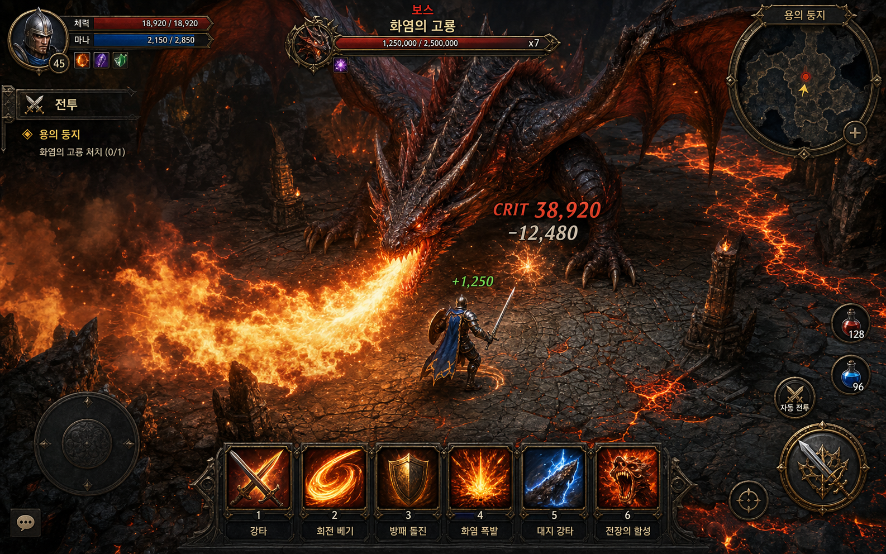

# Dragon Tactics 기획서

> **최종 갱신**: 2026-05-29
> **플랫폼**: 웹 브라우저 (바닐라 HTML/CSS/JS)
> **버전**: v0.2.0 (온보딩 UX 추가)

---


---

## 플레이 미리보기

### 플레이 미리보기


---
## 1. 게임 개요

턴제 카드 + 보드 전술 게임. 1명의 플레이어가 AI 아군 2~4명과 함께 3x5 그리드 위에서 3페이즈 드래곤 보스에 맞서 싸웁니다.

- **3매치 토너먼트** — 매치별 점수를 합산하여 최종 승자 결정
- **히든 미션** — 플레이어마다 숨겨진 필수/선택 미션 보유
- **배신 요소** — 오크 종족은 적대적 미션 수행 가능

### 핵심 루프
```
시작 화면 → 매치 시작 → 턴 반복(이동/공격/카드) → 매치 종료(스코어보드) → 3매치 후 최종 결과
```

---

## 2. 보드 & 배치

- **3행 × 5열** CSS Grid 보드
- **드래곤**: 맵 밖(off-grid) 상단에 위치, 보드 셀을 점유하지 않음
- **공격존**: 행 0 (상단행)에 위치한 플레이어만 드래곤 공격 가능
- **시작 위치**: 모든 플레이어는 행 2 (하단행)에서 시작
- **자동 스왑**: 아군 셀로 이동 시 위치 교환
- **보물 드롭**: 드래곤 HP 감소 시 보드 위에 보물 생성, 플레이어가 밟으면 획득

---

## 3. 턴 시스템

### 턴 순서
- 매 라운드 시작: 드래곤 + 생존 플레이어 1d6 굴림
- 내림차순 정렬, 동점 시 재굴림

### 플레이어 턴 — 택 1
1. **카드 1장 사용** (이동/공격/숨기/힐/정찰/도발/보물)
2. **드로우 +2** (손패 ≤ 3일 때만)
3. **전체 재드로우** (손패 전부 버리고 같은 수 새로 뽑기)
4. **미션 교체** (손패 4장 소모, 미션 2장 재배정)

---

## 4. 종족 (4종)

| 종족 | HP | 패시브 |
|------|-----|--------|
| 인간 🧙 | 5 | 턴 시작 시 5% 확률 추가 드로우 |
| 엘프 🧝 | 5 | 공격 사거리 +1 |
| 드워프 🪓 | 6 | 최대 HP +1 |
| 오크 👹 | 5 | 공격 피해 +1 |

---

## 5. 카드 덱

### 플레이어 공용 덱 (52장)

| 카드 | 수량 | 효과 |
|------|------|------|
| 이동 (사거리 2) | 8 | 직교 방향 최대 2칸 이동 |
| 이동 (사거리 3) | 7 | 직교 방향 최대 3칸 이동 |
| 이동 (사거리 4) | 5 | 직교 방향 최대 4칸 이동 |
| 공격 (사거리 1) | 8 | 인접 대상에 1 피해 |
| 공격 (사거리 2) | 5 | 2칸 이내 대상에 1 피해 |
| 공격 (사거리 3) | 2 | 3칸 이내 대상에 1 피해 |
| 숨기 | 4 | 이번 라운드 피격 시 1 피해 감소 |
| 응급처치 | 3 | 자신 또는 인접 아군 +1 HP |
| 정찰 | 2 | 드래곤 다음 카드 추가 공개 |
| 도발 | 2 | 드래곤 공격을 자신에게 유도 |
| 보물: 용사의 검 🗡️ | 1 | 드래곤에 3 피해 |
| 보물: 생명의 물약 🧪 | 1 | HP 완전 회복 |
| 보물: 바람의 망토 🌬️ | 1 | 1~2칸 무료 이동 |
| 보물: 용비늘 방패 🛡️ | 1 | 다음 피격 완전 무효 |
| 보물: 고대 룬 🔮 | 1 | 다음 주사위 +2 |
| 보물: 고대의 서적 📜 | 1 | 카드 2장 드로우 |

### 드래곤 덱

| 카드 | 효과 | 페이즈 |
|------|------|--------|
| 행 공격 🎲 | 주사위로 결정된 행 전체 2 피해 | 1+ |
| 열 공격 🎲 | 주사위로 결정된 열 전체 2 피해 | 1+ |
| 네 모서리 | 4개 코너 각 2 피해 | 1+ |
| 휴식 | 행동 없음 | 1+ |
| 위협 | 다음 라운드 플레이어 주사위 -1 | 1+ |
| 홀수 행 공격 | 행 0, 2 각 1 피해 | 2+ |
| 전체 공격 | 모든 칸 1 피해 | 2+ |
| 짝수 행 집중 | 행 1 전체 2 피해 | 3+ |
| 광폭 | 모든 칸 1 피해 | 3+ |

---

## 6. 드래곤

### HP & 페이즈

| 페이즈 | HP 범위 | 행동 수 | 공개 카드 수 |
|--------|---------|---------|-------------|
| 1 | 12~9 | 1 | 1 |
| 2 | 8~5 | 2 | 2 |
| 3 | 4~1 | 3 | 3 |

- 총 HP: **12**
- 페이즈 전환: HP ≤8 → 페이즈 2, HP ≤4 → 페이즈 3
- 전환 시 풀스크린 연출 + 사운드 효과

### 보물 드롭
- 드래곤 HP가 10, 8, 6, 4, 2를 지날 때마다 보드 위 랜덤 위치에 보물 드롭
- 플레이어가 해당 셀에 서 있거나 이동하면 자동 획득
- 드래곤 공격 범위 안의 드롭은 소각됨

---

## 7. 미션

### 구조
- 플레이어당 **필수 1 + 선택 1** (숨겨진 상태)
- 종족별 고유 미션 풀 + 공통 풀(8개)에서 랜덤 배정

### 공통 미션 (8개)
| 미션 | 점수 |
|------|------|
| 공격 카드 5회 사용 | 2 |
| 이동 누적 10칸 | 2 |
| 페이즈 1에 용에게 피해 | 3 |
| 드로우 액션 3회 | 2 |
| 미션 교체 1회 사용 | 1 |
| 보물 카드 1장 획득 | 2 |
| 보물 2개 사용 | 4 |
| 드롭 보물 1개 획득 | 2 |

### 점수 계산
- 미션 완수 점수 + 마무리 보너스(3점) + 생존 보너스(1점)
- 3매치 합산, 동점 시 드래곤 누적 피해로 타이브레이크

---

## 8. AI

### 드래곤 AI
- 카드 기반 패턴 공격 (주사위로 행/열 결정)
- 타겟 선택 불필요 (패턴이 고정)

### 아군 AI (우선순위 기반)
1. **생존** — HP ≤1일 때 힐/물약/숨기
2. **배신** (오크) — 30% 확률로 적대 행동
3. **드래곤 처치** — 공격존에서 공격, 마무리 시도
4. **협력** — 부상 아군 치유
5. **손패 관리** — 드로우/이동

---

## 9. UI/UX (v0.2.0)

### 레이아웃
```
┌─────────────────────────────────────────────────────┐
│ 🐉 Dragon Tactics · 매치 1/3 · 라운드 5 · 턴 순서   │
├──────────────────────────────┬──────────────────────┤
│      드래곤 패널 (HP, 페이즈, 공격존 안내)            │
├──────────────────────────────┤  드래곤 카드 공개     │
│                              │  아군 정보           │
│       3 x 5 보드             │  미션 패널           │
│    (위협 표시, 드롭 표시)     │  게임 로그           │
├──────────────────────────────┴──────────────────────┤
│ 플레이어 정보 · 손패 카드 · 액션 버튼               │
└─────────────────────────────────────────────────────┘
```

### 주요 기능
- **온보딩 오버레이** — 게임 최초 실행 시 3단계 슬라이드 튜토리얼 (카드 드래프트 / 전투 시스템 / 종족 특성), "다음부터 표시 안 함" 체크박스, "이해했어요!" 확인 버튼
- **시작 화면** — 파티 인원 선택 (3/4/5인)
- **매치 결과 오버레이** — 점수 상세 + 순위 표시
- **최종 결과 화면** — 3매치 합산 점수 + 재시작
- **아군 정보 패널** — 종족/HP/손패 수 실시간 표시
- **위협 표시** — 드래곤 다음 공격 대상 셀 하이라이트
- **카드 사용 오버레이** — 사용한 카드 확대 연출
- **페이즈 전환 연출** — 풀스크린 텍스트 + 플래시
- **사운드 효과** — Web Audio API (공격/힐/드로우/페이즈/승리/패배)
- **음소거 버튼** — 우측 상단

### 조작
- 카드 클릭 → 유효 타겟 하이라이트 → 타겟 클릭으로 실행
- 드래곤 패널 클릭으로 드래곤 공격 (공격 카드 선택 + 행 0 필요)
- 키보드: 1~6 카드 선택 (미구현)

---

## 10. 기술 구조

### 파일 구성
```
10_DT/
├── index.html          진입점
├── server.js           로컬 개발 서버
├── play.bat            원클릭 실행
├── css/
│   ├── styles.css      메인 스타일
│   └── animations.css  키프레임 애니메이션
├── js/
│   ├── main.js         진입, 시작화면, 매치 흐름
│   ├── state.js        상태 초기화, 매치 시작
│   ├── engine.js       턴/라운드 진행, 액션 실행
│   ├── cards.js        카드 정의, 덱 빌드
│   ├── dragon.js       드래곤 카드 정의, 패턴 해석
│   ├── dragon-ai.js    드래곤 AI
│   ├── ally-ai.js      아군 AI
│   ├── missions.js     미션 풀, 평가, 스코어링
│   ├── races.js        종족 정의, 패시브
│   ├── render.js       DOM 렌더링
│   ├── input.js        유저 입력 처리
│   ├── sound.js        Web Audio 사운드
│   ├── rng.js          시드 기반 난수 생성
│   └── log.js          게임 로그
└── tests/              111개 유닛 테스트 (전체 통과)
```

### 데이터 흐름
```
유저 입력 → engine → state 갱신 → render(state) → DOM
AI 턴 → ally-ai/dragon-ai → engine → render → 다음 턴
```

---

## 11. 변경 이력

| 버전 | 날짜 | 내용 |
|------|------|------|
| v0.2.0 | 2026-05-29 | UX 온보딩 추가 — 카드 드래프트 방법, 전투 흐름, 종족 특성 설명 3단계 슬라이드 |
| v0.1.0 | — | 초기 MVP |

### v0.2.0 (2026-05-29) — 온보딩 UX + 폴리싱
- **온보딩 오버레이 추가** (최초 실행 시 3단계 슬라이드 튜토리얼)
  - 슬라이드 1: 카드 드래프트 — 6종 카드 타입 설명
  - 슬라이드 2: 전투 시스템 — 공격/반격/페이즈/점수 4가지 규칙
  - 슬라이드 3: 종족 특성 — 인간/엘프/드워프/오크 카드형 안내
  - localStorage 기반 "다음부터 표시 안 함" 기능
- 시작 화면 추가 (파티 인원 선택)
- 매치 결과 오버레이 (alert 제거)
- 최종 결과 화면 (3매치 합산 + 재시작)
- 아군 정보 패널 (종족/HP/손패)
- Web Audio 사운드 효과 11종
- 음소거 버튼
- 테스트 111개 전체 통과로 수정

### v0.1.0 (초기 MVP) — 이전 기록
- 3x5 보드, 3매치 토너먼트
- 4종족, 히든 미션, AI 아군
- 드래곤 3페이즈, 패턴 기반 공격
- 보물 드롭 시스템

